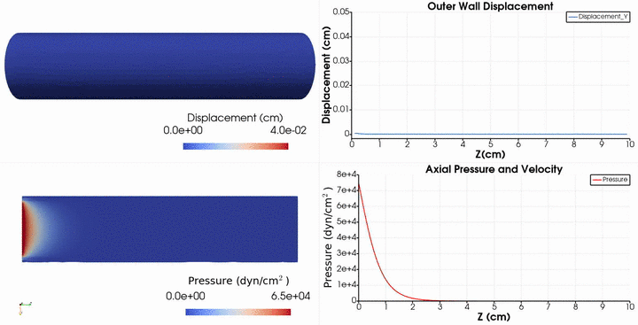

# **Problem Description**

Solve pressure wave propagation in an arterial model using the Arbitrary Lagrangian-Eulerian method [1]. The problem set-up is as follows.

   

And the results are

   

The input file `svFSI.inp` follows the master input file [`svFSI_master.inp`](./svFSI_master.inp) as a template. More on ALE-FSI simulations can be found here:

- SimVascular Website: https://simvascular.github.io/docssvFSI-FSI.html
- Youtube Tutorial: https://www.youtube.com/watch?v=QIpyThIAD7k

## Reference

1.  Liu, Ju, and Alison L. Marsden.  A Unified Continuum and Variational Multiscale Formulation for Fluids, Solids, and Fluid Structure Interaction.  *Computer Methods in Applied Mechanics and Engineering* 337 (August 2018): 549 97. https://doi.org/10.1016/j.cma.2018.03.045.
