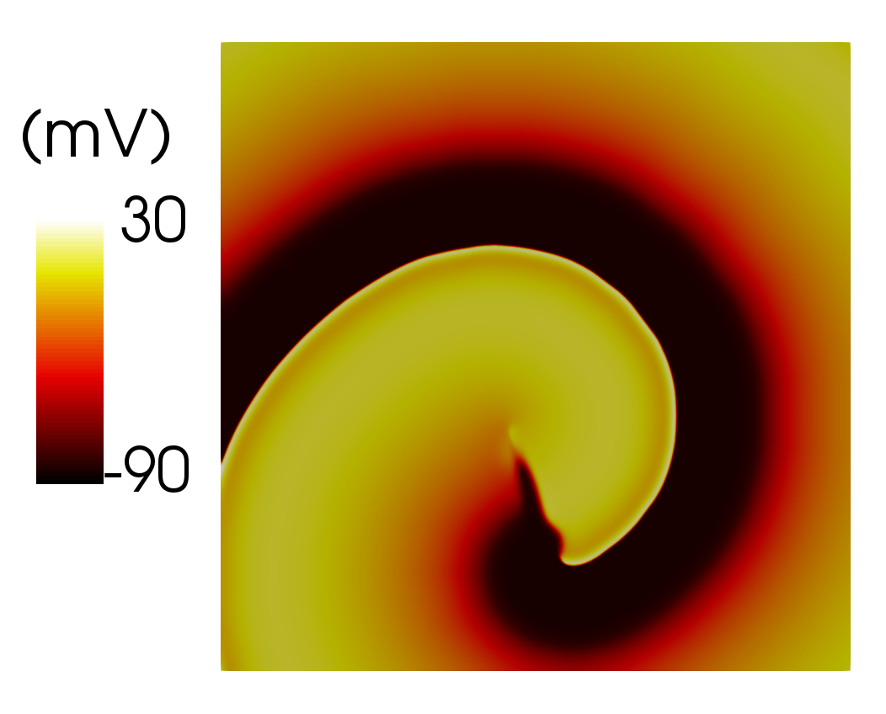

# **Problem Description**

Simulate spiral wave in a plate. 

   

The Bueno-Orovio-Cherry-Fenton model is used to describe the cell activation. For details of the model, please refer to the following publications:

> Bueno-Orovio, Alfonso, Elizabeth M. Cherry, and Flavio H. Fenton. "Minimal model for human ventricular action potentials in tissue." *Journal of theoretical biology* 253, no. 3 (2008): 544-560.

The input file `svFSI.inp` follows the master input file [`svFSI_master.inp`](./svFSI_master.inp) as a template.
