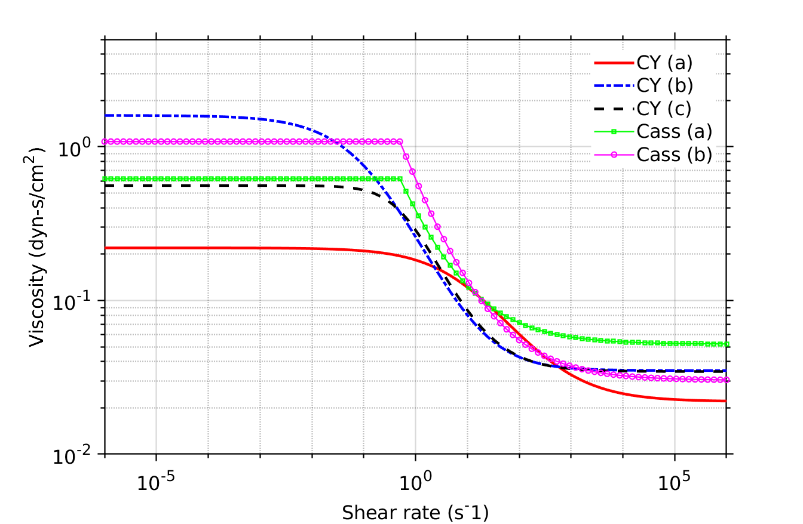

# **Problem Description**

Solve the 3D pipe flow problem with different viscosity models. Currently, `svFSI` supports three viscosity model: Newtonian, Carreau-Yasuda and Casson[1].

<p align="center">
   
</p>

Carreau-Yasuda model is defined as

\left[&space;1&plus;\left(&space;\lambda&space;\dot{\gamma}&space;\right)^a&space;\right]^{\frac{n-1}{a}}&space;)

Here


Casson model is defined as

&space;&plus;&space;k_1(c)\sqrt{\dot{\gamma}}&space;\right]^2)

Here, $k_0(c)$ and $k_1(c)$ are functions of the hematocrit $c$. For more information, please refer to Ref. [1].

The input file `svFSI.inp` follows the master input file [`svFSI_master.inp`](./svFSI_master.inp) as a template. Some specific input options are discussed below:

For Newtonian fluid:

```
   Viscosity: Constant {
      Vsalue: 0.04
   }
```

For Casson fluid

```
   Viscosity: Cassons {
      Asymptotic viscosity parameter: 0.3953
      Yield stress parameter: 0.22803
      Low shear-rate threshold: 0.5
   }
```

For Carreau-Yasuda fluid

```
   Viscosity: Carreau-Yasuda {
      Limiting high shear-rate viscosity: 0.022
      Limiting low shear-rate viscosity: 0.22
      Shear-rate tensor multiplier (lamda): 0.11
      Shear-rate tensor exponent (a): 0.644
      Power-law index (n): 0.392
   }
```


## Reference

1. Boyd, Joshua, James M. Buick, and Simon Green.  Analysis of the Casson and Carreau-Yasuda Non-Newtonian Blood Models in Steady and Oscillatory Flows Using the Lattice Boltzmann Method.  *Physics of Fluids* 19, no. 9 (September 2007): 093103. https://doi.org/10.1063/1.2772250.
