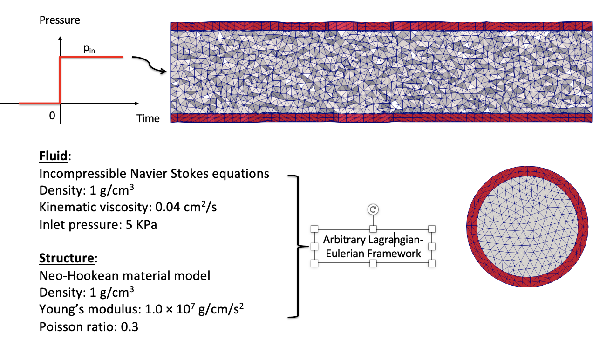
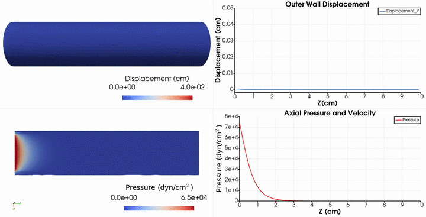

# **Problem Description**

Simulate pressure wave propagation in an arterial model using the Arbitrary Lagrangian-Eulerian method [1]. The problem set-up is as follows.

   

And the results are

   

## References

1.  Liu, Ju, and Alison L. Marsden.  A Unified Continuum and Variational Multiscale Formulation for Fluids, Solids, and Fluid Structure Interaction.  *Computer Methods in Applied Mechanics and Engineering* 337 (August 2018): 549 97. https://doi.org/10.1016/j.cma.2018.03.045.
