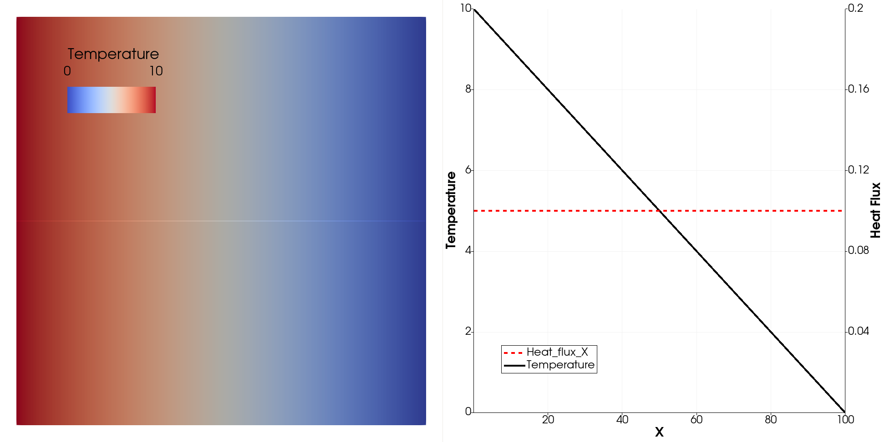

# **Problem Description**

Simulate heat transfer in a 2D plate. A steady, uniform temperature value is specified on the left boundary and zero temperature is prescribed on the right boundary. 

<p align="center">
   
</p>


## Steady Dirichlet BC

Specify a line source with constant temperature is specified on the left boundary.

```
<Add_BC name="left" > 
  <Type> Dir </Type> 
  <Value> 10.0 </Value> 
  <Zero_out_perimeter> false </Zero_out_perimeter> 
</Add_BC>  
```

The `Zero out perimeter` is set to `true` to enforce the temperature on top-left and bottom-left corners to be zero.


