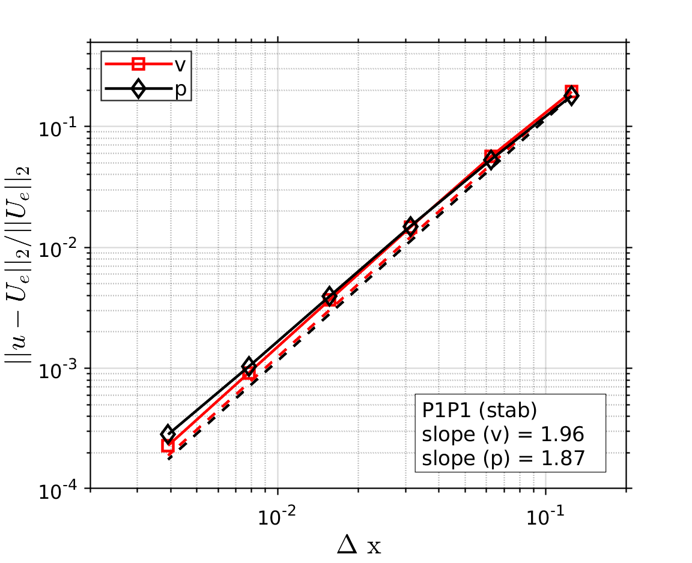

# **Problem Description**

Simulate a 2D Stokes flow problem. A manufactured solution is used to demonstrate the accuracy of the simulation.

<p align="center">
   
</p>
<p align="center">
   
</p>

## User Supplied Body Force and Boundary Values

The method of manufactured solution requires body force and boundary values calculated from the analytic solution. This is done with the custom [python scripts](./P1P1/bforce). They are specified in the input files using 

```
<Add_BF mesh="msh" >
  <Type> volumetric </Type>
  <Time_dependence> general </Time_dependence> 
  <Temporal_and_spatial_values_file_path> ../bforce/N004/bforce.dat </Temporal_and_spatial_values_file_path> 
</Add_BF> 

<Add_BC name="left" > 
  <Type> Dir </Type> 
  <Time_dependence> General </Time_dependence> 
  <Temporal_and_spatial_values_file_path> ../bforce/N004/left_vbc.dat </Temporal_and_spatial_values_file_path> 
</Add_BC>
```

Time dependence is set to **general** because it has both temporal and spatial variations. 
