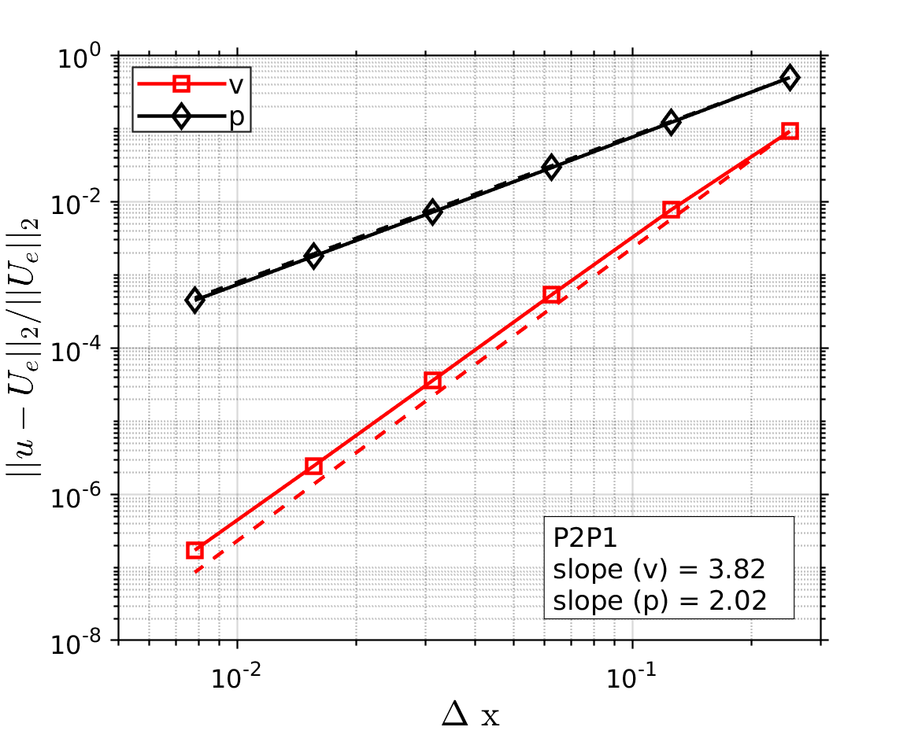

# **Problem Description**

Solve 2D Stokes flow problem. In this example, the method of manufactured solution is used to demonstrate the accuracy of the software.

<p align="center">
   
</p>
<p align="center">
   
</p>

The input file `svFSI.inp` follows the master input file [`svFSI_master.inp`](./svFSI_master.inp) as a template. Some specific input options are discussed below:

## User Supplied Body Force and Boundary Values

The method of manufactured solution requires body force and boundary values calculated from the analytic solution. This is done with the custom [python scripts](./P1P1/bforce). They are specified in the input files using the following directives:

```
   Add BF: msh {
      Type: vol
      Time dependence: general
      Temporal and spatial values file path: ../bforce/N004/bforce.dat
   }

   Add BC: left {
      Type: Dir
      Time dependence: General
      Temporal and spatial values file path: ../bforce/N004/left_vbc.dat
   }
```

For body force, its type is `volumetric` or `vol`. Time dependence is set to `general` since it has both temporal and spatial variations. For boundary condition, its type is `Dirichlet` or `Dir`.
