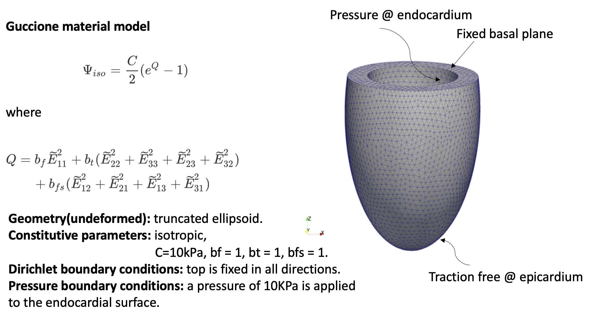
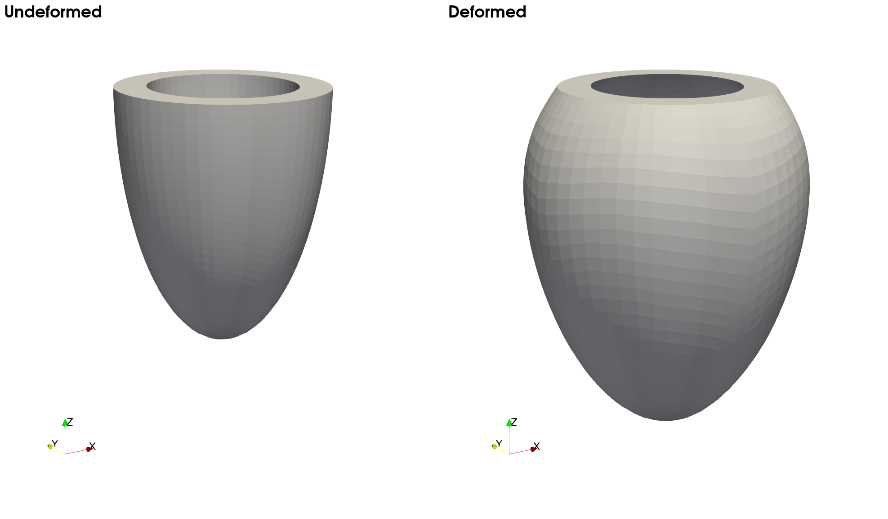

# **Problem Description**

Solve passive inflation of an idealized left-ventricular model. The problem set-up can be found in Problem 2 of Ref [1] and is also shown in the following figure.

<p align="center">
   
</p>

The following plot shows the undeformed and deformed LV model.

<p align="center">
   
</p>

The input file `svFSI.inp` follows the master input file [`svFSI_master.inp`](./svFSI_master.inp) as a template. Some specific input options are discussed below:

## Fiber Direction

In this problem, the left ventricle is modeled as the Guccione hyperelastic material. It requires two user-supplied fiber directions. `svFSI` provides two ways to specify fiber directions. 

If the fiber directions are uniform across the domain, the following commands can be used in the mesh section:

```
   Fiber direction: (1.0, 0.0, 0.0)
   Fiber direction: (0.0, 1.0, 0.0)
```

If the fiber directions vary with spatial location, user can supply a vtu file that contains distributed vector field(s) through the following command:

 ```
    Fiber direction file path: <path to vtu>
 ```

## Pressure-Type Neumann BC

In `svFSI`, the Neumann BC is applied on the reference configuration by default, i.e., the magnitude and direction do not change as the surface deforms. For pressure-type Neumann BC, the applied BC force should remain normal to the deformed surface and the load should scale with the deformed area.  This is achieved through command `Follower pressure load: t`.


## Reference

1. Land, Sander, Viatcheslav Gurev, Sander Arens, Christoph M. Augustin, Lukas Baron, Robert Blake, Chris Bradley, et al.  Verification of Cardiac Mechanics Software: Benchmark Problems and Solutions for Testing Active and Passive Material Behaviour.  *Proceedings of the Royal Society A: Mathematical, Physical and Engineering Sciences* 471, no. 2184 (December 2015): 20150641. https://doi.org/10.1098/rspa.2015.0641.
