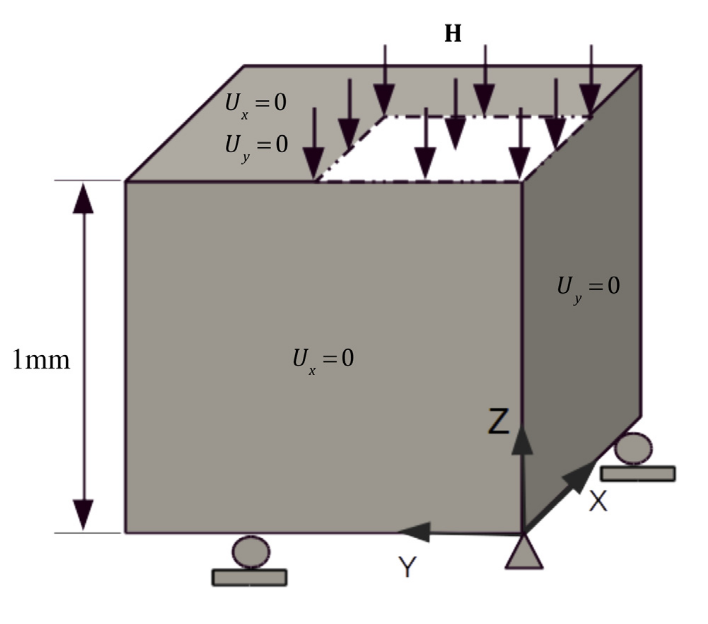

# **Problem Description**

Solve the block compression problem using pressure and velocity-based solid equations. The set-up for the problem is as follows [1]:

   

## Reference

1. Liu, Ju, and Alison L. Marsden.  A Unified Continuum and Variational Multiscale Formulation for Fluids, Solids, and Fluid Structure Interaction.  *Computer Methods in Applied Mechanics and Engineering* 337 (August 2018): 549 97. https://doi.org/10.1016/j.cma.2018.03.045.